<picture>
  <source media="(prefers-color-scheme: dark)" srcset="assets/header-dark.svg">
  <source media="(prefers-color-scheme: light)" srcset="assets/header-light.svg">
  
</picture>

<a href="https://yaxin9luo.github.io/"><picture><source media="(prefers-color-scheme: dark)" srcset="assets/btn-home-dark.svg"><source media="(prefers-color-scheme: light)" srcset="assets/btn-home-light.svg"></picture></a>
<a href="https://scholar.google.com/citations?user=tEaSCzYAAAAJ&hl=en"><picture><source media="(prefers-color-scheme: dark)" srcset="assets/btn-scholar-dark.svg"><source media="(prefers-color-scheme: light)" srcset="assets/btn-scholar-light.svg"></picture></a>
<a href="https://yaxin9luo.github.io/files/CV_YaxinLuo.pdf"><picture><source media="(prefers-color-scheme: dark)" srcset="assets/btn-cv-dark.svg"><source media="(prefers-color-scheme: light)" srcset="assets/btn-cv-light.svg"></picture></a>
<a href="mailto:Yaxin.Luo@mbzuai.ac.ae"><picture><source media="(prefers-color-scheme: dark)" srcset="assets/btn-email-dark.svg"><source media="(prefers-color-scheme: light)" srcset="assets/btn-email-light.svg"></picture></a>

> **Now** · Research intern at Meituan M17 LongCat. Open to research collaboration.

ML PhD student at **MBZUAI** (VILA Lab, advised by Prof. Zhiqiang Shen). I work on one question: how do we get agents to do long, expert work, currently focus on artifact design tasks, and how to keep agents getting better at it? My answer is to post-train the model and co-evolve its harness together.

后训练面向长程agentic任务（目前focus on artifact design）的智能体：模型与它周围的 harness，一起进化。

<picture>
  <source media="(prefers-color-scheme: dark)" srcset="assets/map-dark.svg">
  <source media="(prefers-color-scheme: light)" srcset="assets/map-light.svg">
  
</picture>

### Featured work

<!-- RESEARCH-IMPACT:START -->
**03 · Post-training**

- [**AutoDesign**](https://github.com/Yaxin9Luo/AutoDesign) ★ 232 · arXiv 2026 · *first author* Meta-harness optimization for long-horizon agentic design: editable posters, slides, webpages and videos.
- **LongCat-2.5** · Meituan M17 · 1.6T-parameter model · *post-training contributor* Large-scale post-training for agentic design: harness design, trajectory collection, Mid-Training, SFT and RFT.

**02 · Eval**

- [**Open CaptchaWorld**](https://github.com/MetaAgentX/OpenCaptchaWorld) ★ 92 · NeurIPS 2025 · *first author* Interactive web benchmark for multimodal LLM agents: 20 CAPTCHA types, 225 tasks.
- [**Next-Gen CAPTCHAs**](https://github.com/MetaAgentX/NextGen-CAPTCHAs) ★ 24 · ICML 2026 · *co-first author* Scalable GUI-agent defense built on the cognitive gap between humans and agents.
- [**FigMirror**](https://github.com/VILA-Lab/FigMirror) ★ 521 · open source · *contributor* Reference-driven plotting agents that turn your data into editable Matplotlib in a paper's figure style.

**01 · Multimodal**

- [**γ-MoD**](https://github.com/Yaxin9Luo/gamma-MoD) ★ 46 · ICLR 2025 · *first author* Mixture-of-depth adaptation that skips redundant layers in multimodal LLMs.
<!-- RESEARCH-IMPACT:END -->

<!-- PUBLICATIONS:START -->

<b>All publications</b> (8)

- **arXiv 2026** · [AutoDesign: Meta-Harness Optimization for Long-Horizon Agentic Design](https://arxiv.org/abs/2608.13560) · *first author*
- **ICML 2026** · [Next-Gen CAPTCHAs: Leveraging the Cognitive Gap for Scalable and Diverse GUI-Agent Defense](https://arxiv.org/abs/2602.09012) · *co-first author*
- **ACL 2026** · [LLMSurgeon: Diagnosing Data Mixture of Large Language Models](https://aclanthology.org/2026.acl-long.1964/) · *first author*
- **TMLR 2026** · [Language-Pretraining-Induced Bias: A Strong Foundation for General Vision Tasks](https://arxiv.org/abs/2604.01833) · *first author*
- **NeurIPS 2025** · [Open CaptchaWorld: A Comprehensive Web-based Platform for Testing and Benchmarking Multimodal LLM Agents](https://arxiv.org/abs/2505.24878) · *first author*
- **ICLR 2025** · [γ-MoD: Exploring Mixture-of-Depth Adaptation for Multimodal Large Language Models](https://arxiv.org/abs/2410.13859) · *first author*
- **CVPR 2025** · DViN: Dynamic Visual Routing Network for Weakly Supervised Referring Expression Comprehension · *co-author*
- **ECCV 2024** · [APL: Anchor-Based Prompt Learning for One-Stage Weakly Supervised Referring Expression Comprehension](https://link.springer.com/chapter/10.1007/978-3-031-72624-8_12) · *first author*

Abstracts, figures and co-authors on the [homepage](https://yaxin9luo.github.io/#section/publications).

<!-- PUBLICATIONS:END -->
